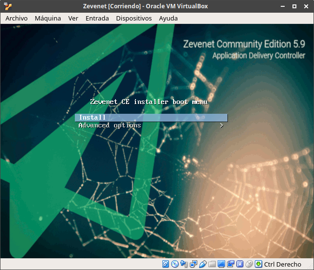
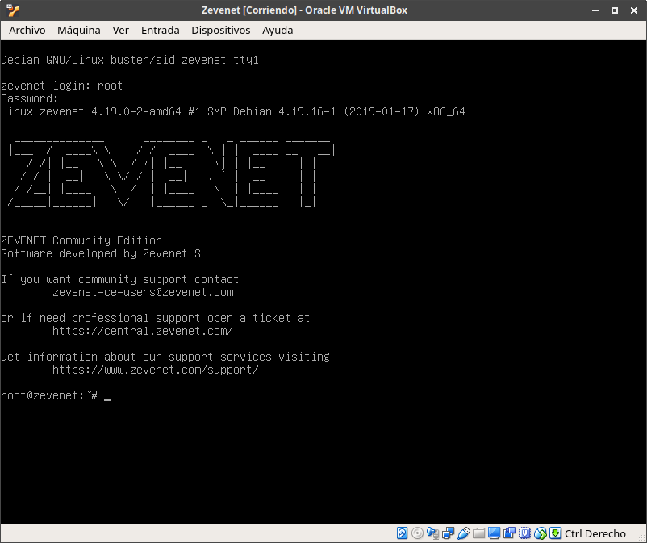
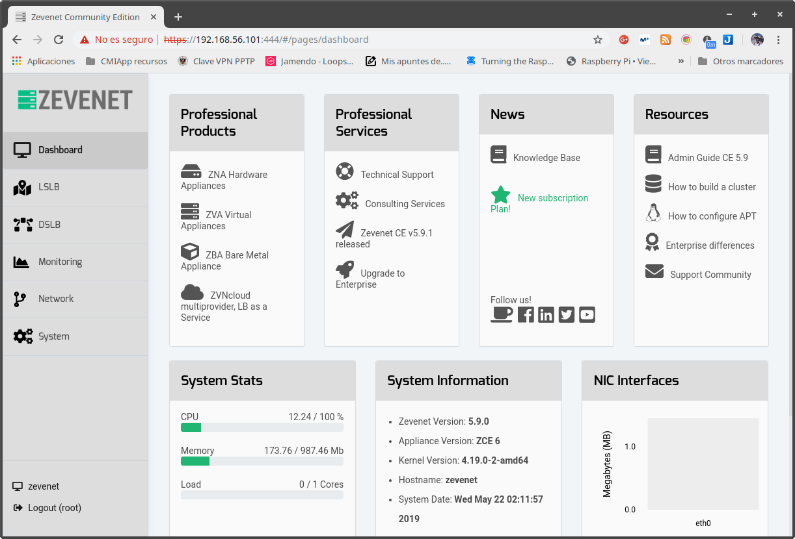
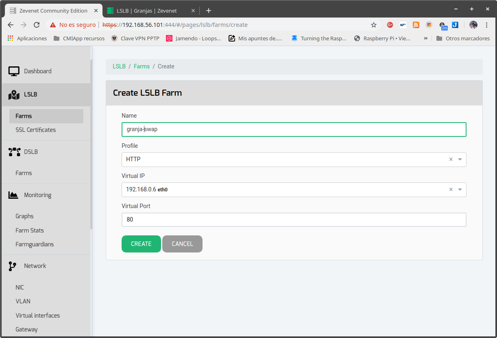
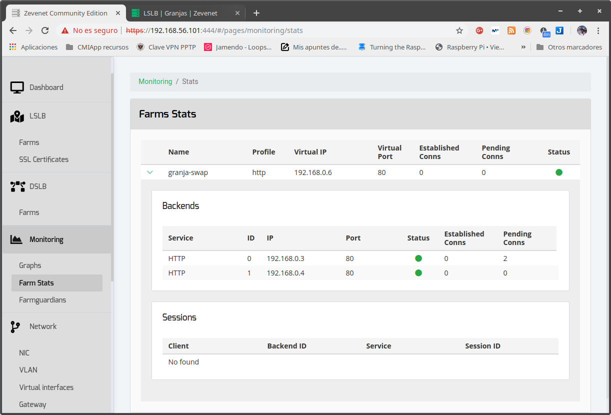
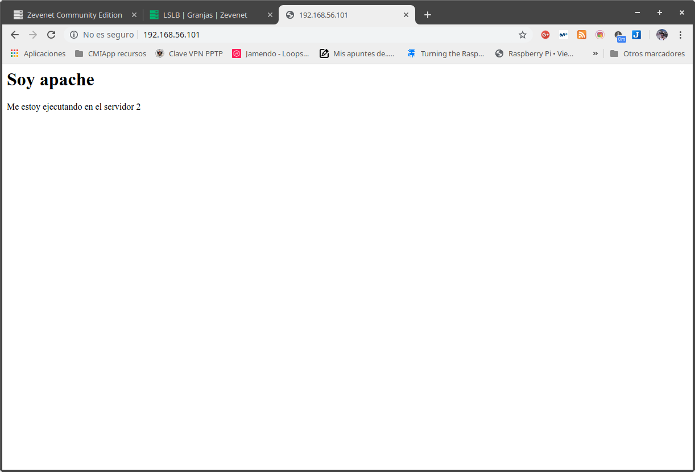

# Ejercicios Teoría SWAP

## Tema 1

### T1.1: Buscar información sobre las tareas o servicios web para los que se usan más los programas que comentamos al principio de la sesión: apache, nginx, thhtpd, Cherokee, node.js
- Apache: Servidor web (sobre todo en sistemas multiusuario).
- Nginx: Servidor web, proxy, balanceador de carga, servidor de vídeo...
- Thttpd: Servidor web muy básico pero ligero sin capacidades avanzadas (No SSL, no PHP...). Muy rápido para servir contenido estático.
- Cherokee: Servidor web ligero escrito como alternativa a Apache.
- Node.js: Servidor de aplicaciones JavaScript. Permite servir sitios escritos en JavaScript como lenguaje de programación de lado del servidor. Suele usarse en conjunto con otros servidores web que le ayudan a acelerar su rendimiento o servir contenido estático.

## Tema 2

### T2.1: Calcular la disponibilidad del sistema si tenemos dos réplicas de cada elemento (en total 3 elementos en cada subsistema).

Sin replicar el Data Center

| Componente             | 1 elemento | 2 elementos | 3 elementos redundantes |
| ---------------------- | ---------- | ----------- | ----------------------- |
| Web                    | 85,0000%   | 97,7500%    | 99,6625000%             |
| Aplicacion             | 90,0000%   | 99,0000%    | 99,9000000%             |
| DB                     | 99,9000%   | 99,9999%    | 99,9999999%             |
| DNS                    | 98,0000%   | 99,9600%    | 99,9992000%             |
| Firewall               | 85,0000%   | 97,7500%    | 99,6625000%             |
| Switch                 | 99,0000%   | 99,9900%    | 99,9999000%             |
| Centro de datos        | 99,9900%   | 99,9900%    | 99,9900000%             |
| ISP                    | 95,0000%   | 99,7500%    | 99,9875000%             |
|                        |            |             |                         |
| Sistema                | 59,86697%  | 94,30193%   | 99,20360%               |
| Horas anuales De caida | 3516       | 499         | 70                      |

Aplicando la fórmula $$As = Ac_{n-1} + (1- Ac_{n-1})*Ac_n $$ aplicado a todos los elementos menos al centro de datos.

### T2.2: Buscar frameworks y librerías para diferentes lenguajes que permitan hacer aplicaciones altamente disponibles con relativa facilidad. Como ejemplo examina [PM2](https://github.com/Unitech/pm2) que sirve para administrar clústeres de NodeJS.

PM2 es un software usado para gestionar los procesos activos de Node y para repartir la carga entre varios servidores de aplicación. Otros sistemas que alcanzan esto son Gunicorn (front-end para aplicaciones escritas en Python) o Supervisord (Sistema de gestión de procesos UNIX que puede ser usado para todo tipo de lenguajes). Estos sistemas permiten tener más de un proceso de servidor en una o varias máquinas y distribuir la carga entre ellos. Además poseen herramientas de monitorización de dichos servicios.

### T2.3: Ejercicio T2.3: ¿Como analizar el nivel de carga de cada uno de los subsistemas en el servidor? Buscar herramientas y aprender a usarlas o recordarlas. 

Centrándonos en servidores Linux tenemos varios sistemas a monitorizar. El más general es la carga del sistema, que nos la puede dar herramientas como `top` o `uptime`. Para monitorizar el subsistema de I/O tenemos `iotop` y para monitorizar la red tenemos herramientas como `nethogs`. Además podemos usar suites completas como `Zabbix` o el stack `ELK` para monitorizar la carga de conjuntos de servidores y centralizar la monitorización.

### T2.4 
- Buscar ejemplos de balanceadores software y hardware.
  - Balanceadores software:
    - Nginx
    - HAProxy
    - Zevenet
    - Seesaw
    - Gobetween (Para sistemas en contenedores)
    - NLB (Windows)
  - Balanceadores hardware
    - F5
    - Cisco
    - Kemp
    - Zen Load Balancer
- Buscar productos para servidores de aplicaciones
  - Apache
  - PHP
  - Gunicorn
  - Nginx
- Buscar productos para servidores de almacenamiento.
  - NFS
  - LVM
  - Lustre

## Tema 3

### T3.1: Buscar con qué órdenes de terminal o herramientas podemos configurar bajo Windows y bajo Linux el enrutamiento del tráfico de un servidor para pasar tráfico de una subred a otra.

Para configurar el enrutamiento en una puerta de enlace en linux podemos hacer lo siguiente:

```bash
echo 1 > /proc/sys/net/ipv4/ip_forward
```

En windows desde la Powershell podemos hacer lo siguiente para habilitar el enrutamiento entre todas las interfaces de red:

```
Set-NetIPInterface -Forwarding Enabled
```


### T3.2: ¿Cómo podemos configurar bajo Windows y bajo Linux el filtrado y bloqueo de paquetes?

En linux tenemos que configurar el filtrado de paquetes mediante IPTables. Por ejemplo, para permitir el enrutamiento entre distintas interfaces de red de sólo ciertos paquetes podemos hacer:

```bash
iptables -A FORWARD -i eth0 -o eth1 -p tcp --syn --dport 80 -m conntrack --ctstate NEW -j ACCEPT
iptables -A FORWARD -i eth0 -o eth1 -m conntrack --ctstate ESTABLISHED,RELATED -j ACCEPT
iptables -A FORWARD -i eth1 -o eth0 -m conntrack --ctstate ESTABLISHED,RELATED -j ACCEPT
```

En windows podemos usar la configuración gráfica del firewall de windows para hacer esto.

## Tema 4

### T4.1: Buscar información sobre cuanto costaría en a actualidad un mainframe que tuviera las mismas prestaciones que una granja web con balanceo de carga y 10 servidores finales. Comparar precio y potencia entre esa hipotética máquina y la granja web de unas prestaciones similares.

Como mainframe vamos a usar como referencia el zBC12 de IBM, un mainframe que parte de un precio de $75.000. Este mainframe de IBM se usa en grandes corporaciones que necesitan un cálculo intensivo de datos (bancos, inversiones, etc) y que no pueden ser distribuidos (sea por software heredado o dificultades de gestión). El precio mencionado anteriormente es poco exacto con las prestaciones de la máquina ya que la empresa no da mucha información al público general. Además no incluye mantenimiento ni el hardware de almacenamiento y red adicional necesario para servir contenido web con este sistema.

Sin embargo por menos $75.000 podemos conseguir 11 servidores para montar una granja web [HP Proliant DL180](https://www.hpe.com/es/es/product-catalog/servers/proliant-servers/pip.overview.hpe-proliant-dl180-gen10-server.1010290574.html)  (€3.206). Las granjas web demuestran una escalabilidad y una tolerancia a fallos mayor que un único sistema central, lo que es mucho más barato y adecuado que un mainframe. Además esta configuración presenta una mayor potencia por un precio más bajo y un consumo energético menor.

### T4.2: Instala y configura en una máquina virtual el balanceador *gobetween*. Compara con la dificultad de la instalación y configuración usando nginx o haproxy.


### T4.3: Investigar sobre precio y caracterísiticas de balanceadores hardware comerciales. Comparar lo que encontremos.


### T4.4: Instala y configura una máquina virtual con el balanceador Zevenet.

La instalación del balanceador Zevenet es muy sencilla. Se puede instalar como aplicación o instalar una ISO con un sistema debian mínimo y zevenet incluido. Nos decantamos por esa opción.


La instalación es muy sencilla y rápidamente llegamos a un sistema instalado.




Para entrar en la GUI de Zevenet entramos al puerto 444 con la contraseña que hemos puesto durante la instalación.



Para crear una granja de balanceo seguimos los pasos de la GUI y añadimos las direcciones IP de los backends. Por defecto Zevenet hace un balanceo en round-robin pero podemos definir prioridades de los distintos servidores. Además permite hacer pruebas a los servidores para comprobar su estado.




Aquí vemos lo fácil que ha sido instalar zevenet y que balancee la carga de nuestra granja web de prácticas.

### T4.5: Implementar un pequeño servicio web en los servidores finales que devuelva el % de CPU y % RAM que en un instante tiene en uso dicho servidor. Lo debe devolver como una cadena de texto plano que representa ambos porcentajes.

```php
<?php
  $carga = sys_getloadavg();
	$proc = exec('nproc');
	$porcentaje_carga = $carga/$proc;

	$free = shell_exec('free');
	$free = (string)trim($free);
	$free_arr = explode("\n", $free);
	$mem = explode(" ", $free_arr[1]);
	$mem = array_filter($mem);
	$mem = array_merge($mem);
	$porcentaje_mem = $mem[2]/$mem[1]*100;

	echo "$porcentaje_carga $porcentaje_mem";
?>  
```


### T4.6: Buscar información sobre los métodos de balanceo que implementan los dispositivos recogidos en el ejercicio 4.2


### T4.7: Probar los métodos de redirección con HTTP (mas o menos). ¿Cuál es adecuada y cual no lo es para hacer balanceo de carga global?. ¿Hay alguna que sea adecuada?

(Pista:no. Cuando es para elegir idioma está muy bien, pero para hacer un balanceo de carga contra un servidor que redirija, etc.)


### T4.8: Buscar información sobre los bloques de IP para los distintos países o continentes. (O al menos intentarlo). Implementar en JavaScript o PHP la detección de la zona desde donde se conecta un usuario.


### T4.9: Buscar información sobre métodos y herramientas para implementar GSLB.


## Tema 5

### T5.1: Buscar información sobre como calcular el número de conexiones por segundo.

En un benchmark, el número de conexiones por segundo lo definimos como $$\text{peticiones_por_segundo}=\text{num_peticiones}/\text{tiempo_de_prueba}$$ 

### T5.3: Buscar información sobre características, funcionalidad, disponibilidad para diversos SO. para monitorizar las prestaciones de un servidor.

Los distintos sistemas operativos en su núcleo proveen al administrador herramientas de monitorización y estadísticas. En sistemas linux tenemos toda esa información disponible a través del pseudosistema de archivos `/proc`. Sin embargo hay utilidades que nos presentan esos datos de forma más sencilla, por ejemplo la utilidad `uptime` nos permite ver en texto plano (que podemos usar en scripts) cuanto tiempo lleva el sistema encendido y su carga media. Otras herramientas como `free` o `nethogs` nos permiten ver otros parámetros como la memoria disponible o el uso de ancho de banda de las interfaces de red. Sin embargo lo más útil y cómodo para el administrador de sistemas es usar suites de monitorización de prestaciones más potentes que nos permitan ver de un vistazo todos los parámetros del sistema e incluso el estado de los servicios que estamos sirviendo. Ejemplos de estas suites son ELK (Elastic, Logstash, Kibana), Zabbix, Nagios (para la monitorización de redes), etc.


## Tema 6

### T6.1: Aplicar con iptables una política de denegar todo el tráfico en una de las máquinas de prácticas. Comprobar el funcionamiento.
Aplicar con iptables una política de permitir todo el tráfico
en una de las máquinas de prácticas. Comprobar el funcionamiento.


### T6.2: Comprobar qué puertos tienen abiertos nuestras máquinas, su estado y que programa o demonio lo ocupa

Para comprobar los puertos abiertos en nuestra máquina podemos hacer `netstat -tupuna`. La salida que nos da es la siguiente:

```
Conexiones activas de Internet (servidores y establecidos)
Proto  Recib Enviad Dirección local         Dirección remota       Estado       PID/Program name     Temporizador
tcp        0      0 127.0.0.1:3306          0.0.0.0:*               ESCUCHAR    1044/mysqld          apagado (0.00/0/0)
tcp        0      0 127.0.0.1:5939          0.0.0.0:*               ESCUCHAR    1484/teamviewerd     apagado (0.00/0/0)
tcp        0      0 0.0.0.0:57621           0.0.0.0:*               ESCUCHAR    24950/spotify        apagado (0.00/0/0)
tcp        0      0 192.168.122.1:53        0.0.0.0:*               ESCUCHAR    1307/dnsmasq         apagado (0.00/0/0)
tcp        0      0 127.0.0.53:53           0.0.0.0:*               ESCUCHAR    635/systemd-resolve  apagado (0.00/0/0)
tcp        0      0 0.0.0.0:33047           0.0.0.0:*               ESCUCHAR    24950/spotify        apagado (0.00/0/0)
tcp        0      0 127.0.0.1:631           0.0.0.0:*               ESCUCHAR    24085/cupsd          apagado (0.00/0/0)
tcp        0      0 127.0.0.1:41184         0.0.0.0:*               ESCUCHAR    25576/app --node-in  apagado (0.00/0/0)
tcp6       0      0 :::80                   :::*                    ESCUCHAR    1051/apache2         apagado (0.00/0/0)
tcp6       0      0 ::1:631                 :::*                    ESCUCHAR    24085/cupsd          apagado (0.00/0/0)
udp        0      0 0.0.0.0:60780           0.0.0.0:*                           24950/spotify        apagado (0.00/0/0)
udp        0      0 192.168.122.1:53        0.0.0.0:*                           1307/dnsmasq         apagado (0.00/0/0)
udp        0      0 127.0.0.53:53           0.0.0.0:*                           635/systemd-resolve  apagado (0.00/0/0)
udp        0      0 0.0.0.0:67              0.0.0.0:*                           1307/dnsmasq         apagado (0.00/0/0)
udp        0      0 0.0.0.0:68              0.0.0.0:*                           24849/dhclient       apagado (0.00/0/0)
udp        0      0 0.0.0.0:49363           0.0.0.0:*                           718/avahi-daemon: r  apagado (0.00/0/0)
udp        0      0 0.0.0.0:57621           0.0.0.0:*                           24950/spotify        apagado (0.00/0/0)
udp        0      0 0.0.0.0:631             0.0.0.0:*                           24086/cups-browsed   apagado (0.00/0/0)
udp        0      0 224.0.0.251:5353        0.0.0.0:*                           13971/chrome --type  apagado (0.00/0/0)
udp        0      0 224.0.0.251:5353        0.0.0.0:*                           13931/chrome         apagado (0.00/0/0)
udp        0      0 0.0.0.0:5353            0.0.0.0:*                           718/avahi-daemon: r  apagado (0.00/0/0)
udp        0      0 0.0.0.0:1900            0.0.0.0:*                           24950/spotify        apagado (0.00/0/0)
udp6       0      0 :::48301                :::*                                718/avahi-daemon: r  apagado (0.00/0/0)
udp6       0      0 :::5353                 :::*                                718/avahi-daemon: r  apagado (0.00/0/0)

```

Podemos ver los distintos servicios con puertos abiertos: `spotify, avahi, apache, cups, dnsmasq, mysql, teamviewer`

### T6.3: Buscar información acerca de los tipos de ataques más comunes en servidores web (p.ej. secuestros de sesión). Detallar en que consisten y como se pueden evitar.

Los ataque más comunes a servidores son:

- Denegación de servicio: generar una gran cantidad de peticiones falsas para sobrecargar un sistema y que no de el servicio que le corresponde a los usuarios reales. Se puede mitigar usando un firewall o usando un sistema anti-DDOS como el ofrecido por CloudFlare.
- Secuestros de sesión: Se simula la sesión de un usuario suplantando su IP o las cookies de su navegador para acceder al sistema sin tener autorización para hacerlo. Hay formas de evitar este ataque mediante comprobaciones de seguridad estrictas en las aplicaciones o mediante el uso de conexiones cifradas para evitar que las cookies puedan ser capturadas mediante un análisis de tráfico.
- Ataques por fuerza bruta contra el sistema: Prácticamente todos los servidores conectados a internet y con el puerto 22 de SSH abierto reciben miles de intentos de conexión mediante SSH de usuarios maliciosos. Estos ataques suelen usar diccionarios de nombres de usuario y contraseña para intentar ganar acceso a los sistemas y, o bien robar datos o usarlos como parte de botnets para otros ataques. Para evitar este acceso no autorizado a nuestro servidor podemos: bloquear el puerto 22 (o cambiarlo), mantener una política fuerte de contraseñas (si tienes una raspberry pi cambiar inmediatamente el login `pi/raspberry` por defecto) o permitir el inicio de sesión exclusivamente mediante claves privadas/públicas.

## Tema 7

### T7.1: Buscar información sobre los sistemas de ficheros en red más usados en la actualidad y comparar sus características

Los sistemas de archivos en red más usados en la actualidad son:

- LUSTRE: Es es más usado en los grandes centros de datos. Sólo es compatible con sistemas POSIX.
  - Tiene una alta tolerancia a fallos
  - Es software libre
  - Tiene un alto rendimiento
  - Su configuración es bastante compleja.
  - No merece la pena para sistemas pequeños (pocas máquinas).
- NFS: Aunque no es un sistema de archivos es una forma incluida en el kernel Linux de montar espacios de almacenamientos remotos en una máquina
  - No tiene tolerancia a fallos
  - Está incluido en el núcleo Linux
  - Permite acceso simultáneo de lectura al mismo archivo.
  - Se puede montar desde el arranque y usar un sistema por NFS como disco de arranque.
  - Es muy fácil de configurar.
- Amazon S3: Es un servicio de Amazon para almacenar archivos (referidos como objetos) en su plataforma en la nube. Se puede montar como un sistema de archivos local.
  - Es fácilmente auditable
  - Está soportado por la infraestructura de los Amazon Web Services.
  - Es de pago.
  - Los datos no están en el mismo espacio físico que la granja web.
  - No hay que preocuparse de copias de seguridad.

