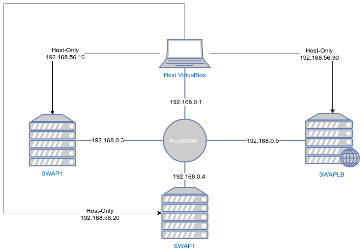
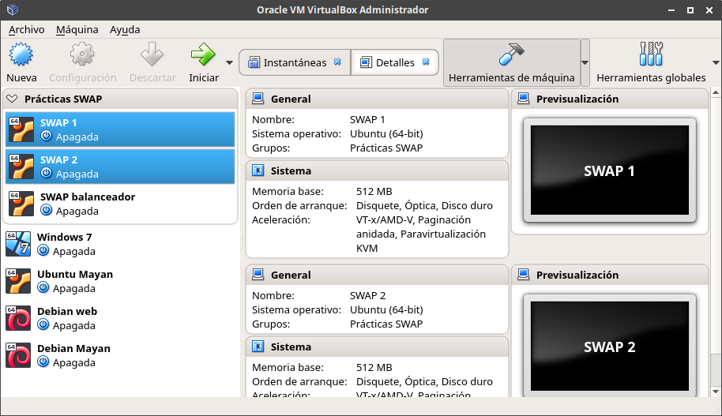
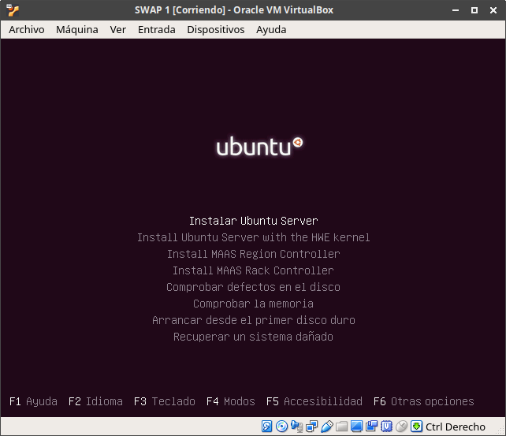
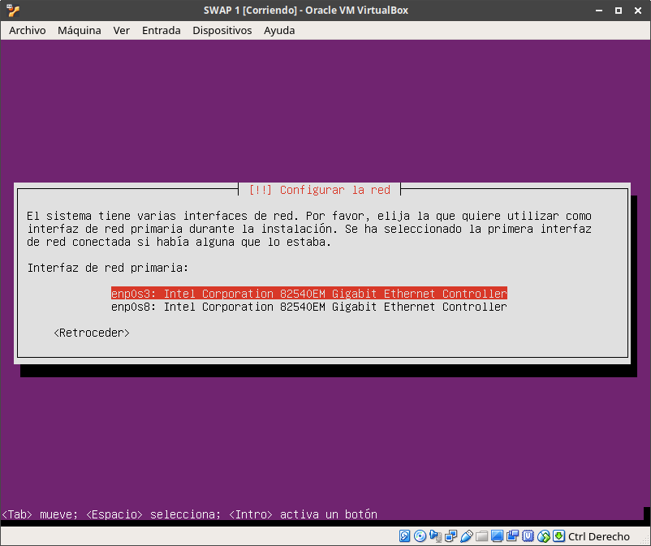
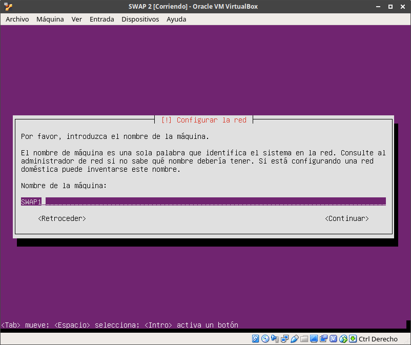
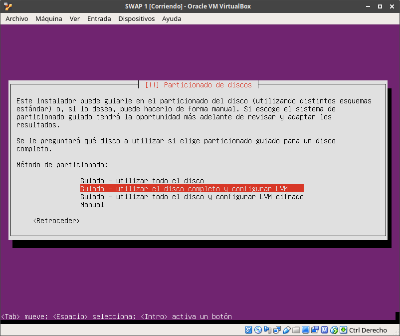
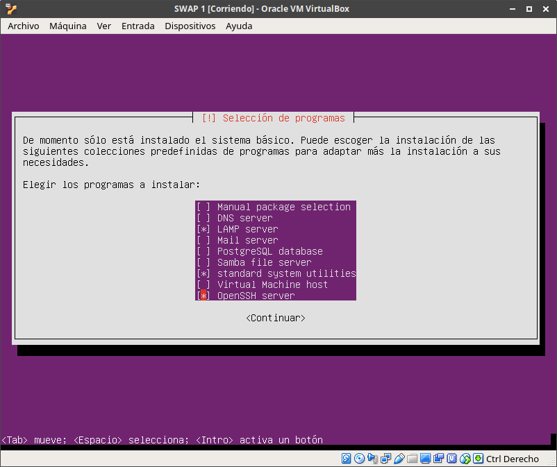
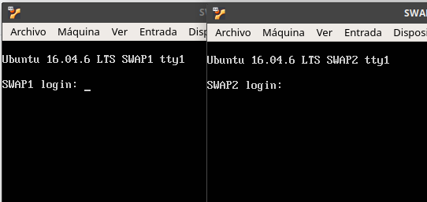
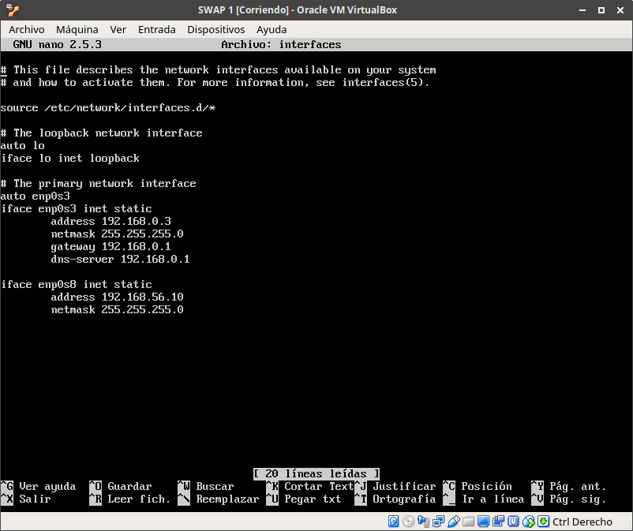
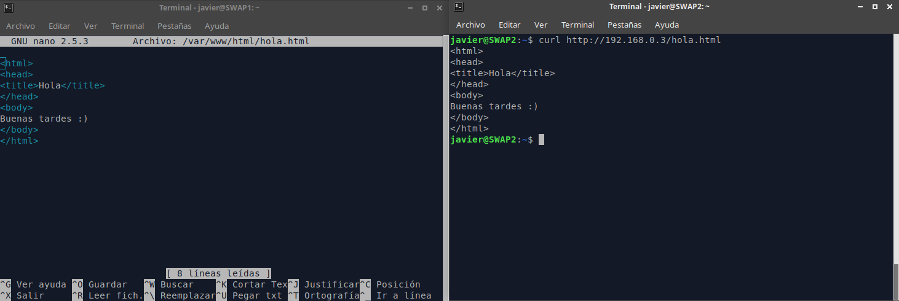

# Práctica 1 - SWAP

## Autor: Javier Sáez de la Coba

## Objetivos

Nuestro objetivo es tener 2 máquinas actuando de servidores web con apache y una tercera máquina actuando como balanceador de carga con HAProxy o Nginx.

Vamos a instalar primero 2 máquinas virtuales con Ubuntu Server, OpenSSH Server y LAMP. Más tarde instalaremos un ubuntu server básico en el que más tarde instalaremos el software de balanceo de carga que necesitemos.

Las máquinas van a estar conectada por una red NAT llamada RedSWAP. Además por otra interfaz estarán conectadas a una interfaz Host-Only, de forma que desde nuestro ordenador podamos conectarnos a las máquinas virtuales.

La red RedSWAP es una red CIDR 192.168.0.0/24. La red de las conexiones Host-Only es la red 192.168.56.0/24. Ambas redes tienen habilitados un servidor DHCP. Sin embargo vamos a configurar las direcciones de ambas máquinas de forma manual.

El diagrama de las redes será el siguiente:

En resumen, la configuración de estas máquinas va a ser:

| Configuración | Valor SWAP1   | Valor SWAP2   | Valor SWAPLB  |
| ------------- | ------------- | ------------- | ------------- |
| hostname      | SWAP1         | SWAP2         | SWAPLB        |
| IP enp0s3     | 192.168.0.3   | 192.168.0.4   | 192.168.0.6   |
| IP enp0s8     | 192.168.56.10 | 192.168.56.20 | 192.168.56.30 |
| username      | javier        | javier        | javier        |

## Proceso

Empezamos creando dos máquinas virtuales: SWAP1 y SWAP2. Creamos una tercera para las próximas prácticas.

En estas máquinas virtuales activamos dos interfaces de red: una conectada a la red RedSWAP y otra conectada al Host-Only.

Instalamos ubuntu usando el procedimiento habitual, configurando los nombres de host de las máquinas y en principio conectándonos a la red mediante DHCP.

A la hora de elegir el software a instalar seleccionamos LAMP y el servidor de SSH

Ya tenemos instaladas las dos máquinas virtuales.

Ahora configuramos de manera manual las direcciones IP de las dos máquinas tanto en la red interna como en la red host-only. De esta manera conseguimos que no nos de problemas al conectarnos si Virtualbox decidiera cambiar las direcciones asignadas de manera automática.

Probamos ahora a ver si ambas máquinas se ven. Esto lo hacemos ya desde terminales nativos de la máquina anfitrión conectándonos mediante SSH por la interfaz host-only.

### Instalación de la máquina balanceadora de carga

La instalación de la máquina para el futuro balanceo de carga lo hacemos igual que con las máquinas anteriores pero sin instalar LAMP, únicamente seleccionando el servidor de SSH.

