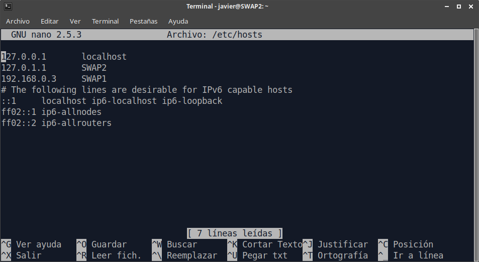
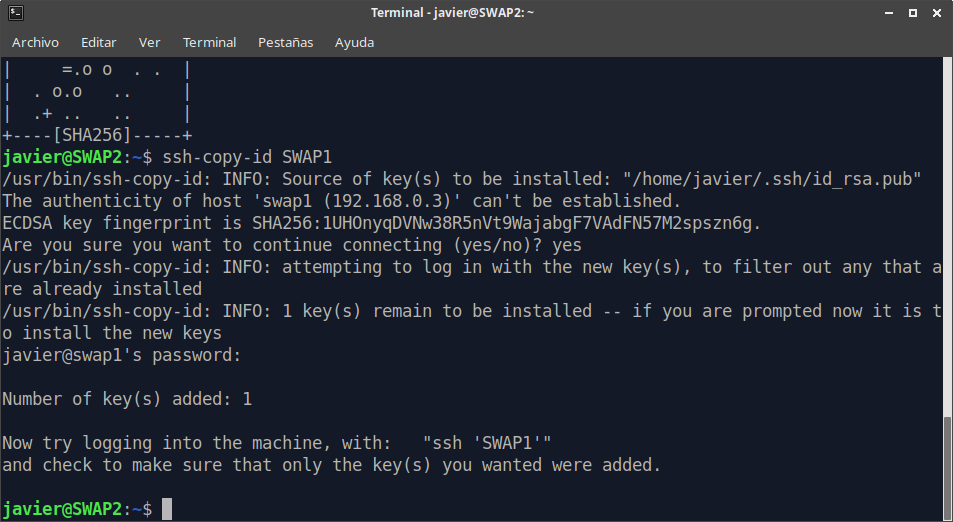
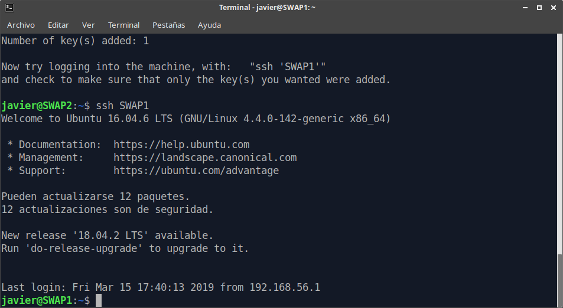
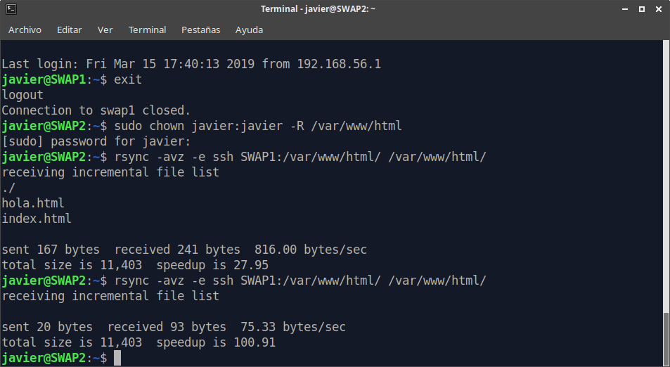
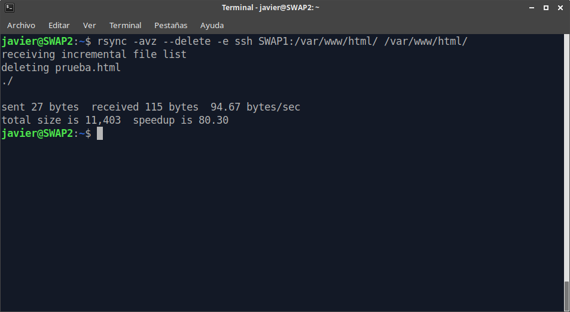
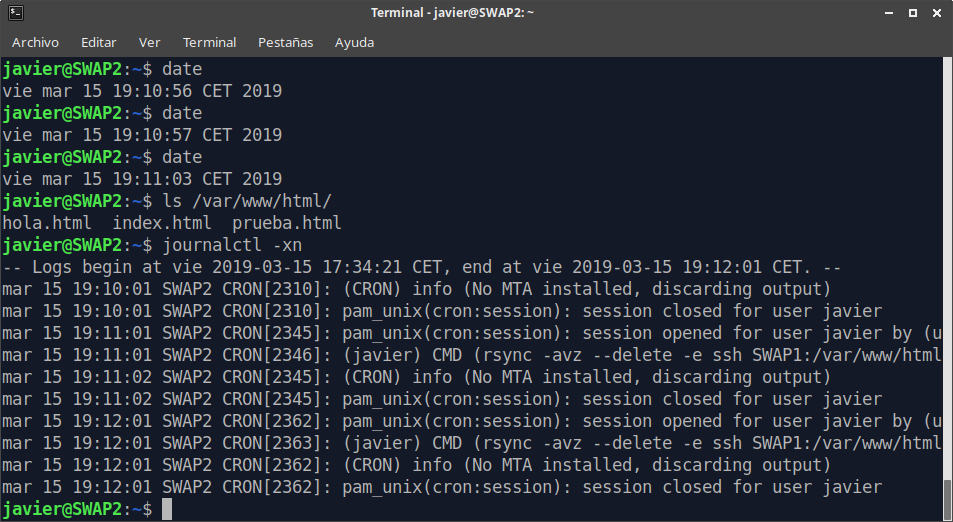

# Práctica 2 - SWAP

## Autor: Javier Sáez de la Coba

## Objetivos

Tenemos que configurar nuestras máquinas para que mantengan sincronizadas la carpeta raíz del servidor web (`/var/www/html`). Vamos a suponer que tenemos nuestras máquinas `SWAP1` y `SWAP2` en una configuración en la que `SWAP1` actúa de servidor HTTP y `SWAP2` actúa de servidor de reserva que entraría en funcionamiento a servir páginas web. Como la segunda máquina tiene casi todos sus recursos libres será la que se va a encargar de la sincronización de las carpetas. Para ello necesitamos realizar las siguientes acciones en esta máquina 2:

- Configurar el acceso remoto mediante ssh con autenticación por clave pública.
- Comprobar el funcionamiento de rsync.
- Automatizar mediante crontab la ejecución de rsync.

Hay que tener en cuenta varias cosas a la hora de llevar a cabo estas acciones. Es importante tener cuidado con la sintaxis de `rsync` ya que algo tan minúsculo como las barras al final de directorio cambian el comportamiento de la herramienta (no es lo mismo poner `/var/www/`  que `/var/www`). También hay que asegurarse de que los comandos los estamos ejecutando en la máquina correcta (en nuestro caso `SWAP2`) y con el usuario adecuado (si creamos las claves de ssh como root luego no nos sirven para autenticarnos como usuario estándar).

## Proceso

Empezamos configurando los archivos `/etc/hosts` de las máquinas virtuales. Aunque esto no es necesario ni es tarea de la práctica permite una mayor legibilidad de los comandos y una tasa de equivocaciones menor que identificando las máquinas por una dirección IP. Este es el archivo `hosts` de la máquina `SWAP2` identificando a la máquina `SWAP1` por su dirección IP en la red interna que comunica las máquinas:



Una vez que hemos hecho esta primera configuración empezamos a realizar la práctica. Generamos un par de claves pública y privada como el usuario estándar de la máquina `SWAP2` mediante el comando `ssh-keygen`. Es importante que cuando nos pida contraseña para proteger la clave no introduzcamos nada, pues lo que intentamos conseguir es acceder de una máquina a otra sin la necesidad de introducir ninguna contraseña. Ahora copiamos en la máquina remota nuestra clave pública. Esto podríamos hacerlo a mano copiando el contenido de nuestro `/home/usuario/.ssh/id_rsa.pub` en el archivo `/home/usuario/.ssh/authorized_keys` de la máquina remota, pero vamos a usar una herramienta de ssh que ya hace este trabajo por nosotros: `ssh-copy-id`. Lo ejecutamos en la máquina `SWAP2` para copiar la clave a la máquina `SWAP1`.

`ssh-copy-id SWAP1`



Ahora podemos acceder a `javier@SWAP1` desde `javier@SWAP2` sin introducir ninguna contraseña:



Una vez que tenemos acceso por ssh de forma automática probamos si funciona `rsync`. Antes de esto vamos a dar permisos al usuario `javier` en ambas máquinas para que lea y escriba el directorio objetivo (`/var/www/html`). Esto lo hacemos con la orden `sudo chown javier:javier -R /var/www/html`. Una vez hecho esto y con contenido en la carpeta de la máquina 1 ejecutamos `rsync` varias veces. Observamos que solo copia archivos la primera vez que lo ejecutamos.

`rsync -avz --delete -e ssh SWAP1:/var/www/html/ /var/www/html/`



Si borramos algún archivo de la máquina remota, gracias a la opción `--delete` se elimina también de la máquina local.



Podemos proceder a instalar en el crontab la orden que sincronice las carpetas cada minuto. Para ello editamos el archivo `/etc/crontab` de la máquina `SWAP2`. 

Añadimos la siguiente linea:

```
# m h dom mon dow user	command
* * * * * javier rsync -avz --delete -e ssh SWAP1:/var/www/html/ /var/www/html/
```

Vemos en el log la ejecución de cron cada minuto. Cabe notar que el archivo `prueba.html` no existía a las `vie mar 15 19:10:57 CET 2019`



## Conclusiones

Ahora tenemos dos servidores configurados y sincronizados entre sí, por lo que podríamos intercambiarlos y los contenidos servidos vía web sería idénticos. Como anotación final podemos decir que los cambios en los archivos únicamente se sincronizan de `SWAP1 -> SWAP2` , por lo que si la primera máquina cayera, habría que detener `rsync` ya que nunca podría completar ninguna copia. Esto se puede hacer implementando algún mecanismo de tipo `heartbeat`. 

También cabe recordar que el uso que estamos haciendo aquí de `rsync` es lo más básico posible y que `rsync` se puede personalizar de muchas maneras posibles mediante ficheros externos de configuración o ejecutándolo como servicio del sistema

De todas formas, la configuración aquí desplegada es suficiente para mantener la coherencia entre las dos máquinas de nuestra granja web a nivel de ficheros.