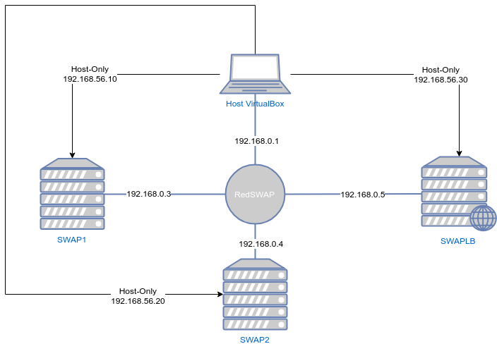

# Práctica 3 - SWAP

## Balanceo de carga

## Autor: Javier Sáez de la Coba

## Objetivos

De la práctica 2 tenemos dos máquinas configuradas como servidores web corriendo apache. Ahora vamos a añadir una tercera máquina que actuará como balanceador de carga para esas dos máquinas. Esta máquina será la puerta de nuestra granja web y repartirá el tráfico entre los dos servidores finales. De esta manera podremos repartir la carga y conseguir servir más peticiones en conjunto que con una única máquina servidora. Además la máquina balanceadora de carga protegerá a las máquinas finales de ataques externos ya que actuará también de firewall, permitiendo pasar únicamente las peticiones web.

El esquema de nuestra red es el siguiente:



Para configurar el balanceo de carga vamos a usar tres softwares de balanceo de carga distintos usando round-robin como método de balanceo: nginx, HAProxy y Pound

Además, para hacer un test de carga de los servidores vamos a usar un pequeño script de python:

```python
from boom.boom import load, calc_stats

url='http://192.168.56.20'
min_concurrency=1
max_concurrency=1001
step = 100

concurrency=min_concurrency

print("Concurrency, avg, rps")

while(concurrency<max_concurrency):
    r=load(url, 5000, concurrency,0, 'GET', None, 'text/plain', None, quiet=True)
    s=calc_stats(r)
    print("{}, {}, {}".format(s.count, s.avg, s.rps))
    concurrency = concurrency + step


```

Este script realiza múltiples pruebas aumentando gradualmente el número de conexiones simultáneas y saca los tiempos medios de respuesta en un fichero csv con el que podemos generar una gráfica.

Si ejecutamos este script sobre una sola máquina podemos extraer la siguiente gráfica:


## Proceso

### Instalación y configuración de nginx

Para instalar nginx simplemente hacemos `sudo apt install nginx`

Nos vamos al fichero de configuración `/etc/nginx/sites-enabled/default` y lo sobrescribimos con la siguiente configuración:

```
upstream apaches {
   server 192.168.0.3;
   server 192.168.0.4;
}
   server{
   listen 80;
   server_name balanceador;
   access_log /var/log/nginx/balanceador.access.log;
   error_log /var/log/nginx/balanceador.error.log;
   root /var/www/;
   location /
   {
      proxy_pass http://apaches;
      proxy_set_header Host $host;
      proxy_set_header X-Real-IP $remote_addr;
      proxy_set_header X-Forwarded-For $proxy_add_x_forwarded_for;
      proxy_http_version 1.1;
      proxy_set_header Connection "";
   }
}

```

Tenemos que sobrescribir el fichero porque por defecto nginx viene configurado como servidor web

Reiniciamos el servicio con ''sudo systemctl restart nginx` y ya está listo para ser probado. Si hacemos peticiones al balanceador de carga con curl podemos ver como reparte las peticiones siguiendo un reparto por turnos.


Durante el test de carga podemos ver la actividad de los servidores, a la izquierda están los `htop` de los apaches y a la derecha arriba el `htop` de la máquina balanceadora:


### Instalación y configuración de HAProxy

Para instalar HAProxy hacemos `sudo apt install haproxy`

Cambiamos al archivo de configuración  `/etc/haproxy/haproxy.cfg` por lo siguiente:

```
global
    daemon
    maxconn 256
defaults
    mode http
    contimeout 4000
    clitimeout 42000
    srvtimeout 43000
frontend http-in
    bind *:80
    balance roundrobin
    default_backend servers
backend servers
    server swap1 192.168.0.3
    server swap2 192.168.0.4

```

Y hacemos el test de carga:


### Instalación y configuración de Pound

Cambiamos el archivo de configuración `/etc/pound/pound.cfg`:

```
User		"www-data"
Group		"www-data"
#RootJail	"/chroot/pound"

## Logging: (goes to syslog by default)
##	0	no logging
##	1	normal
##	2	extended
##	3	Apache-style (common log format)
LogLevel	1

## check backend every X secs:
Alive		30

## use hardware-accelleration card supported by openssl(1):
#SSLEngine	"<hw>"

# poundctl control socket
Control "/var/run/pound/poundctl.socket"


######################################################################
## listen, redirect and ... to:

## redirect all requests on port 8080 ("ListenHTTP") to the local webserver (see "Service" below):
ListenHTTP
	Address 0.0.0.0
	Port	80

	## allow PUT and DELETE also (by default only GET, POST and HEAD)?:
	xHTTP		0

	Service
		BackEnd
			Address	192.168.0.3
			Port	80
		End
		BackEnd
			Address 192.168.0.4
			Port	80
		End
	End
End

```

Y en `/etc/default/pound` ponemos el parámetro `startup=1` para arrancar el servicio.

Ahora procedemos al test de carga con el balanceador pound


## Comparativa

Una vez que tenemos todos los datos de los test de carga con el tiempo medio de respuesta y las peticiones por segundo podemos comparar el rendimiento de los distintos métodos de balanceo. Las gráficas generadas son las siguientes (todos los test de carga se han repetido 3 veces y se ha realizado la media de cada valor para intentar minimizar los efectos de sobrecargas puntuales del sistema anfitrión).


Con respecto a los tiempos de respuesta podemos observar que todos los sistemas se comportan de manera parecida, sobre todo en baja concurrencia. Sin embargo cuando aumentamos el número de peticiones concurrentes haproxy y nginx demuestran tiempos más bajos que apache simple y pound. Además se demuestra que el uso de balanceadores de carga mejora el tiempo de respuesta hasta un segundo en situaciones de muchas conexiones simultáneas. Sin embargo a cargas bajas podemos observar que el servidor apache sin balanceo tiene un menor tiempo de respuesta. Esto se debe a que cuando estamos usando un balanceador de carga la petición tiene que pasar por una máquina intermedia que tiene que procesar la petición, modificarla y reenviarla al servidor de back-end correspondiente. Esto introduce una latencia adicional. Sin embargo en situaciones de alta carga esta latencia adicional no es significativa comparada con la introducida por los cuellos de botella que hay en los servidores.


En el caso de la gráfica de peticiones por segundo tenemos una situación parecida a la de los tiempos de respuesta. Un servidor solo puede manejar pocas peticiones concurrentes de forma correcta sin introducir latencia de balanceo. Sin embargo en situaciones de alta cara el servidor colapsa y baja su rendimiento. Con un balanceador de carga esto se solventa ya que no se satura un servidor final, sino que la carga se reparte entre varios servidores. Esto hace que se puedan seguir sirviendo varias conexiones simultáneas. 

En ambas gráficas se muestran picos de bajadas de rendimiento que no tienen por qué estar ligadas exclusivamente a saturación en el servidor. Todo el entorno está montado sobre un único equipo hardware con 4 núcleos de ejecución. En el equipo se están ejecutando a la vez las 3 máquinas virtuales (SWAP1, SWAP2 y SWAPLB) y el programa de pruebas. Además el sistema de virtualización de red (Subsistema de red de VirtualBox) también consume recursos, así como el resto de procesos en espacio de usuario abiertos. Esto hace que haya degradación del rendimiento global. Aún así podemos utilizar los datos obtenidos ya que muestran una situación de saturación global de la máquina. Esto significa que aunque no sea el propio apache el que se ha saturado si lo ha hecho la máquina host sobre la que corre, lo que es equivalente a saturar la máquina virtual. Esto unido a una saturación del sistema de entrada y salida (Por cada petición del test hay 1 petición a la máquina balanceadora + 1 petición al servidor apache con sus correspondientes establecimientos de conexiones TCP) hacen que el rendimiento global baje.

A pesar de esto, al estar todos los test en igualdad de condiciones podemos usarlo para comparar los distintos balanceadores de carga.

## Conclusiones

Hemos configurado una máquina virtual como balanceador de carga usando tres softwares distintos de balanceo de carga: nginx, HAProxy y Pound. Además hemos sometido la granja web a un test de carga con 5000 peticiones por prueba repitiendo la prueba 15 veces aumentando el número de peticiones concurrentes desde una única conexión simultánea hasta 1401 conexiones aumentando de 100 en 100.

Gracias a este test de carga hemos podido comparar el rendimiento de los distintos softwares y podemos determinar que **Nginx** y **HAProxy** funcionan de manera **similar** mientras que **Pound** muestra un **peor rendimiento** que los dos citados anteriormente. Además podemos observar que introducir un sistema de balanceo de carga introduce una pequeña latencia adicional en las peticiones HTTP pero que mejora notablemente el rendimiento del sistema cuando la carga de trabajo es grande.

Sin embargo en el test con ab notamos las diferencias entre Nginx y HAProxy, por lo que podemos decir que, de los balanceadores probados, **HAProxy es el que mejor desempeño tiene.**

## Anexo I: Test con Apache Benchmark

Como es requerido por el guión de prácticas vamos a someter a la granja web a un test de carga con la herramienta Apache Benchmark. Vamos a intentar sobrecargar el sistema. Para ello vamos a fijarnos en la cantidad de peticiones que fallan y en tiempo medio de respuesta como medida de la latencia. Vamos a usar el siguiente comando para la ejecución de la prueba: `ab -n 50000 -c 300 http://192.168.0.30/`

El archivo `ejecuciones_ab.md` contiene la salida en bruto de ab contra los distintos balanceadores. Aquí hay un cuadro resumen:

| Balanceador          | Peticiones fallidas | Tiempo  | Media de tiempo por petición | ms 50% | Petición más larga | KB/s   |
| -------------------- | ------------------- | ------- | ---------------------------- | ------ | ------------------ | ------ |
| Apache sin balancear | 0                   | 27.884s | 167.305 ms                   | 38     | 27869              | 691.69 |
| Nginx                | 0                   | 57.905s | 347.432 ms                   | 89     | 57885              | 332.24 |
| HAProxy              | 0                   | 20.481s | 122.887 ms                   | 91     | 1366               | 941.7  |
| Pound                | 12                  | 55.778s | 334.671 ms                   | 111    | 55761              | 345.7  |

En el test de carga con Apache Benchmark podemos ver que el desempeño medio de Pound es el peor de todos los casos. **HAProxy** es el balanceador más rápido estando por detrás de él **Nginx**. Sin embargo el apache sin balancear se comporta de manera similar. En todos los casos se nota la sobrecarga que supone usar un balanceador intermedio. Además, viendo los datos **HAProxy** es el sistema que más ancho de banda es capaz de generar.

La diferencia de resultados entre los obtenidos con el script Python  y ab se deben a la naturaleza de lenguaje interpretado de Python contra la naturaleza de ab, escrito en C y muy optimizado.