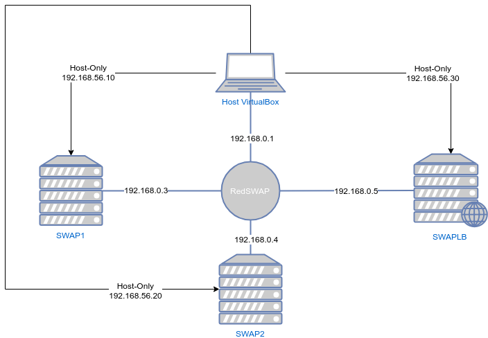
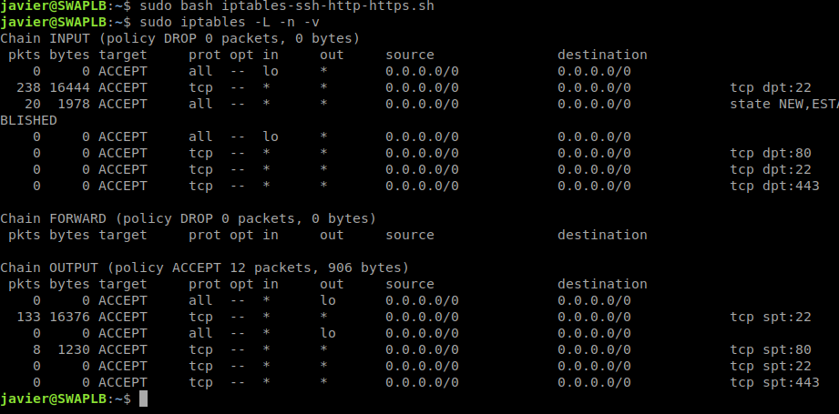
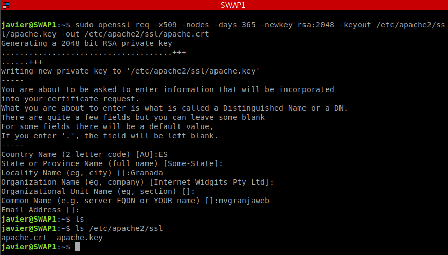
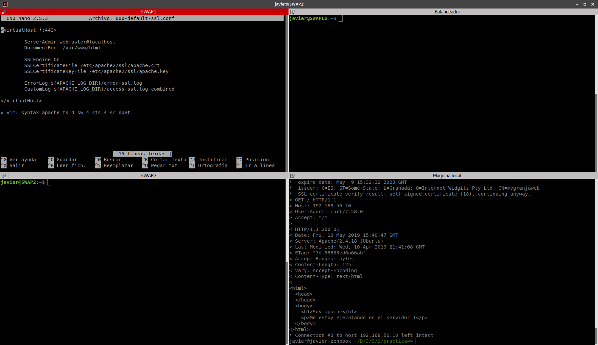
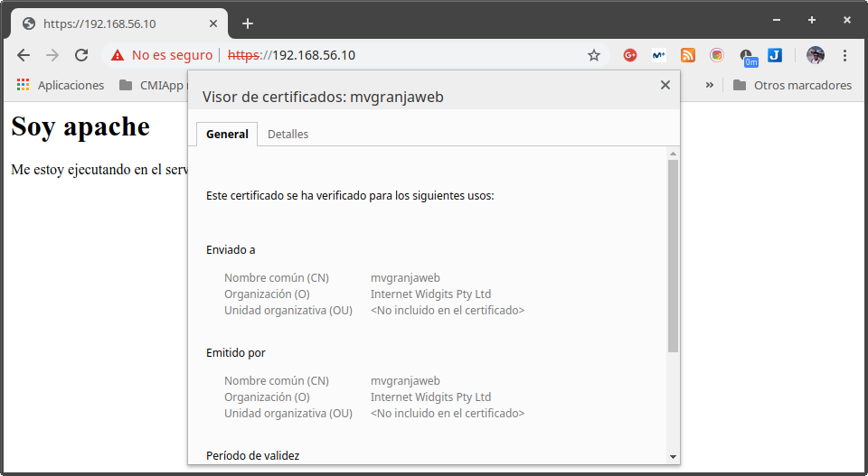
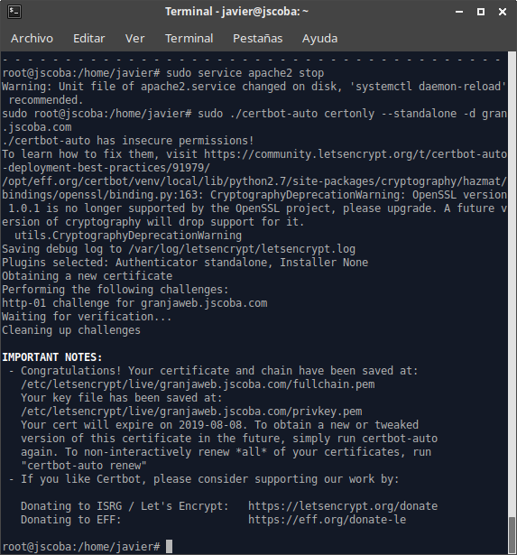
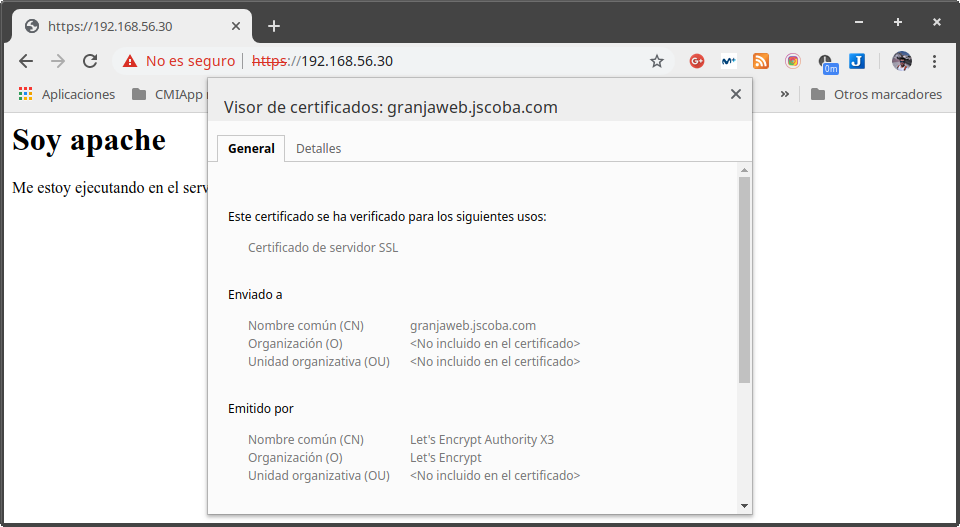

# Práctica 4 - SWAP

## Asegurar la granja web

## Autor: Javier Sáez de la Coba

## Objetivos

De la práctica 3 tenemos dos máquinas configuradas como servidores web corriendo apache y una tercera máquina que actúa de balanceador de carga entre ambas máquinas. En esta práctica vamos a cerrar todas las puertas de entrada a nuestra granja web desde internet y vamos a asegurar las comunicaciones entre los usuarios y nuestro sistema. Para ello vamos a habilitar el cortafuegos del sistema (`IPTables`) y configurar el acceso mediante el protocolo HTTPS a nuestra granja web.

El esquema de nuestra red es el siguiente:



## 1.- Cortafuegos

Si hacemos un primer escaneo de puertos abiertos de nuestra máquina balanceadora nos da el siguiente resultado:

- Puertos abiertos: 22 y 80

Esto a priori parece un buen resultado pero se debe realmente a que los únicos servicios que tenemos instalados son nginx y openssh. Sin embargo si tuvieramos algún servicio "interno" (como un servidor de impresión o un servidor de archivos) este también aparecería. Para evitar esta casuística vamos a activar el servicio de IPTables. El despliegue del cortafuegos lo vamos a hacer en dos fases: una primera regla va a bloquear todo el tráfico de entrada. Una segunda regla va a habilitar el tráfico únicamente en los puertos 22, 80 y 443.

Las reglas a activar son las siguientes:

```bash
# Denegar todo el tráfico entrante
iptables -P INPUT DROP
iptables -P FORWARD DROP
iptables -P OUTPUT ACCEPT
iptables -A INPUT -m state --state NEW,ESTABLISHED -j ACCEPT

# Habilitar el tráfico en la interfaz de localhost
iptables -A INPUT -i lo -j ACCEPT
iptables -A OUTPUT -i lo -j ACCEPT

# Permitir el tráfico por el puerto 80 (HTTP)
iptables -A INPUT -p tcp --dport 80 -j ACCEPT
iptables -A OUTPUT -p tcp --sport 80 -j ACCEPT

# Permitir el tráfico por el puerto 22 (SSH)
iptables -A INPUT -p tcp --dport 22 -j ACCEPT
iptables -A OUTPUT -p tcp --sport 22 -j ACCEPT

# Permitir el tráfico por el puerto 443 (HTTPS)
iptables -A INPUT -p tcp --dport 443 -j ACCEPT
iptables -A OUTPUT -p tcp --sport 443 -j ACCEPT

```



## 2.- Certificados SSL

Para poder habilitar el servicio de HTTPS como via de acceso a nuestra granja web nos hace falta un certificado SSL para encriptar las comunicaciones. Históricamente los certificados SSL reconocidos por los navegadores de los usuarios han sido siempre muy costosos y difíciles de conseguir. En esta práctica vamos a usar un certificado autofirmado, que no está reconocido por el navegador pero que podemos conseguir mediante un comando. En la parte opcional de la práctica veremos como conseguir un certificado SSL firmado por el proyecto Let's Encrypt, que nos permite obtener certificados reconocidos por los navegadores de forma gratuita.

Para generar nuestro certificado autofirmado vamos a utilizar la máquina 1, aunque luego el certificado lo pasaremos al resto de máquinas.

`openssl req -x509 -nodes -days 365 -newkey rsa:2048 -keyout /etc/apache2/ssl/apache.key -out /etc/apache2/ssl/apache.crt`



Y ahora vamos a configurar el certificado en el servidor apache. Para ello activamos el módulo de ssl de apache con `sudo a2enmod ssl` y duplicar el archivo de configuración `/etc/apache2/sites-enabled/000-default.conf` y añadir un nuevo virtualhost igual que el copiado pero escuchando al puerto 443 y con el certificado configurado. El nuevo archivo de configuración tiene el siguiente aspecto:

```
<VirtualHost *:443>

        ServerAdmin webmaster@localhost
        DocumentRoot /var/www/html

        SSLEngine On
        SSLCertificateFile /etc/apache2/ssl/apache.crt
        SSLCertificateKeyFile /etc/apache2/ssl/apache.key

        ErrorLog ${APACHE_LOG_DIR}/error-ssl.log
        CustomLog ${APACHE_LOG_DIR}/access-ssl.log combined

</VirtualHost>

```

Reiniciamos el servicio apache y está listo. Probamos la conexión SSL con curl y con un navegador web de escritorio.





Ahora vamos a copiar mediante scp el certificado a la máquina 2 y al balanceador y vamos a habilitar SSL en ambas máquinas. De este modo podremos acceder a la granja web mediante el balanceador. Además el tráfico dentro de la granja web también estará asegurado con SSL (aunque si nuestra red interna es una DMZ esto puede no ser necesario y sería suficiente habilitar esto solo en el balanceador).

Al archivo de configuración de nginx hay que añadirle la siguiente sección:

```
server{
   listen 443 ssl;
   server_name balanceador;
   access_log /var/log/nginx/balanceador.access.log;
   error_log /var/log/nginx/balanceador.error.log;
   root /var/www/;
   ssl_certificate /etc/nginx/ssl/apache.crt;
   ssl_certificate_key /etc/nginx/ssl/apache.key;
   location /
   {
      proxy_pass http://apaches;
      proxy_set_header Host $host;
      proxy_set_header X-Real-IP $remote_addr;
      proxy_set_header X-Forwarded-For $proxy_add_x_forwarded_for;
      proxy_http_version 1.1;
      proxy_set_header Connection "";
   }
}

```

Reiniciamos los servicios y ya está listo. Tenemos asegurada nuestra granja web.


## Ejercicio opcional: Certificado SSL de Let's Encrypt.

Vamos a generar un certificado SSL gratuito y reconocido por parte del proyecto Let's Encrypt. Para ello necesitamos tener un nombre de dominio y una IP pública. Para esta práctica vamos a obtener un certificado para `granjaweb.jscoba.com`, que será utilizado para la granja web montada para el trabajo de la asignatura.

Para obtener el certificado ejecutamos `certbot-auto certonly --standalone -d granjaweb.jscoba.com`.



Una vez tenemos los certificados generados podemos pasar el archivo con el certificado y la clave privada al balanceador de carga y sustituimos los archivos generados anteriormente.

Ahora ya podemos ver como utilizamos el certificado que acabamos de generar en la granja web.



Si accediéramos mediante DNS y no mediante IP el navegador nos pondría el aviso de "Es seguro".