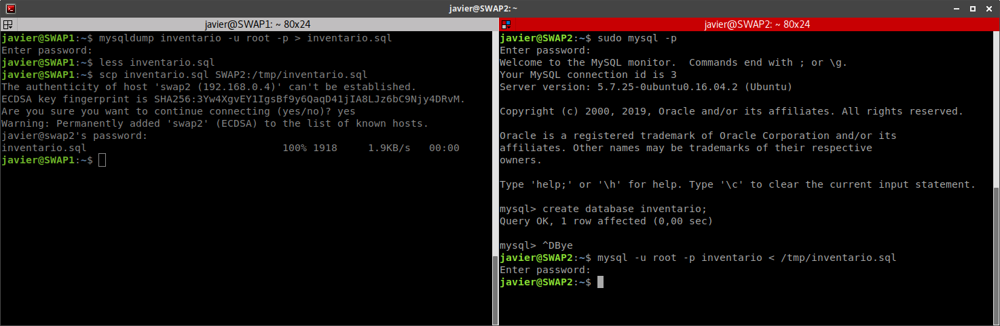
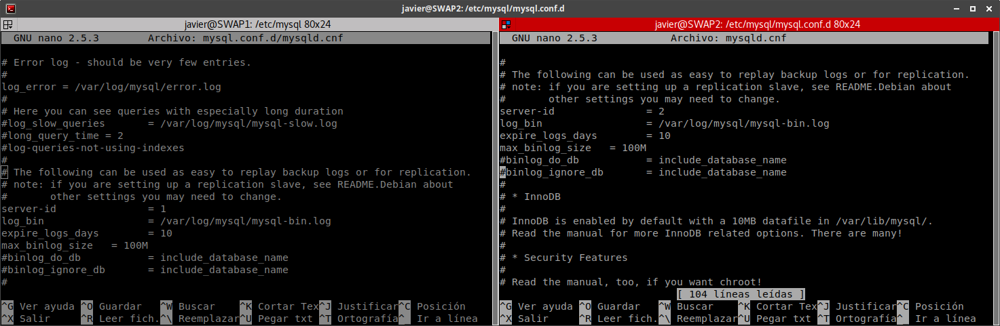
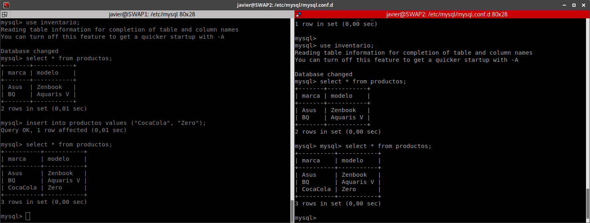
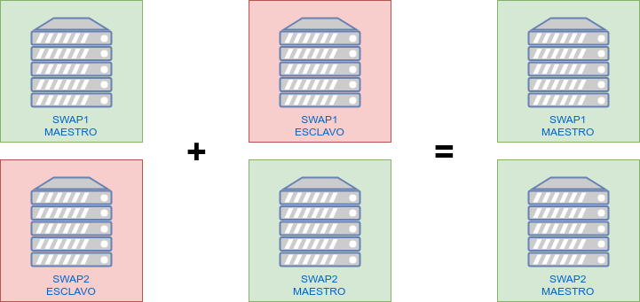
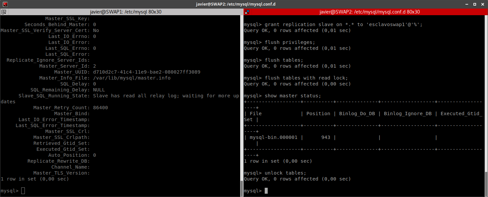
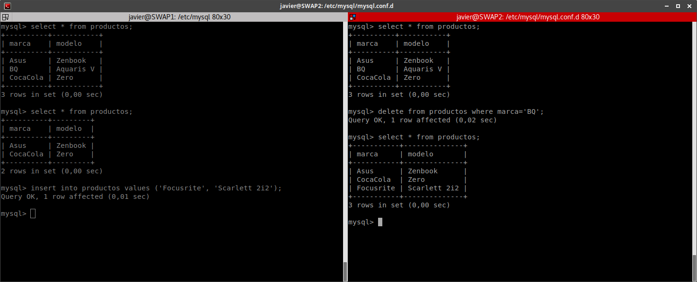

# Práctica 5 - SWAP

## Replicación de bases de datos MySQL

## Autor: Javier Sáez de la Coba

## Objetivos

En esta práctica vamos a conseguir replicar los datos de la base de datos entre nuestros dos servidores LAMP, de forma que ambas bases de datos sean idénticas en ambos servidores. La finalidad de esto es asegurar que si cae un servidor no perdemos los datos y aumentar el rendimiento del sistema. Vamos a hacer dos configuraciones: En la primera configuración SWAP1 actuará de Master (se podrán hacer operaciones de escritura) y SWAP2 actuará de esclavo (se podrán hacer operaciones de lectura pero no de escritura). En la segunda configuración SWAP2 tendrá el papel de Master también y podremos hacer escrituras a ambos servidores y las bases de datos se mantendrán coherentes entre si.

El esquema de nuestra red es el siguiente:


## 1.- Configuración Maestro-Esclavo de MySQL/MariaDB

Para poder configurar la replicación de MySQL primero tenemos que crear una base de datos. Para ello creamos la base de datos `inventario` con la tabla `productos` e insertamos algunos datos de prueba.

```
mysql> create database inventario;
Query OK, 1 row affected (0,00 sec)

mysql> use inventario;
Database changed
mysql> create table productos (marca varchar(150), modelo varchar(200));
Query OK, 0 rows affected (0,04 sec)

mysql> show tables;
+----------------------+
| Tables_in_inventario |
+----------------------+
| productos            |
+----------------------+
1 row in set (0,00 sec)

mysql> insert into productos values ("Asus", "Zenbook");
Query OK, 1 row affected (0,02 sec)

mysql> insert into productos values ("BQ", "Aquaris V");
Query OK, 1 row affected (0,00 sec)

mysql> select * from productos;
+-------+-----------+
| marca | modelo    |
+-------+-----------+
| Asus  | Zenbook   |
| BQ    | Aquaris V |
+-------+-----------+
2 rows in set (0,00 sec)
```

Ahora vamos a transferir este esquema de base de datos a la segunda máquina. Para ello usamos `mysqldump` para generar una copia de seguridad de la base de datos que acabamos de crear y lo transferimos mediante SCP (o mediante una carpeta compartida como la de la práctica 6) a la otra máquina donde la importamos.



Ahora que ya tenemos la base de datos creada podemos empezar a configurar de forma maestro-esclavo los servidores.

Empezamos cambiando el identificador del servidor en las máquinas (por defecto es 1) y permitiendo las conexiones desde máquinas externas. Para esto cambiamos el archivo `/etc/mysql/mysql.conf.d/mysqld.cnf` de las máquinas modificando la propiedad `server-id` y `bind-address`. Además habilitamos los registros de errores y el registro binario descomentando las opciones `log_error` y `log_bin`. 



Cuando hayamos guardado los cambios reiniciamos el servicio para recargar la configuración con `sudo service mysql restart`.

Ahora ya tenemos preparados nuestros servicios para hacer la replicación. Ahora vamos a "enganchar" ambos servidores dándole los roles que le corresponden a cada uno. Empezamos por el **maestro** donde vamos a habilitar la replicación y crear un usuario que pueda hacer dicha replicación de la base de datos de ejemplo.

```mysql
mysql> create user esclavoswap2 identified by 'esclavo';
Query OK, 0 rows affected (0,01 sec)

mysql> grant replication slave on *.* to 'esclavoswap2'@'%';
Query OK, 0 rows affected (0,01 sec)

mysql> flush privileges;
Query OK, 0 rows affected (0,01 sec)

mysql> flush tables;
Query OK, 0 rows affected (0,01 sec)

mysql> flush tables with read lock;
Query OK, 0 rows affected (0,00 sec)

mysql> show master status;
+------------------+----------+--------------+------------------+-------------------+
| File             | Position | Binlog_Do_DB | Binlog_Ignore_DB | Executed_Gtid_Set |
+------------------+----------+--------------+------------------+-------------------+
| mysql-bin.000001 |      903 |              |                  |                   |
+------------------+----------+--------------+------------------+-------------------+
1 row in set (0,00 sec)

mysql> unlock tables;
Query OK, 0 rows affected (0,00 sec)

```

Los datos importantes son el usuario y la contraseña del esclavo, el archivo de replicación y la posición por la que vamos en ese archivo (en nuestro caso el archivo es `mysql-bin.000001` y vamos por la posición 903).

Ahora en el **esclavo** procedemos a darle los datos del maestro e iniciar la replicación.

```mysql
mysql> change master to
    -> MASTER_HOST='192.168.0.3',
    -> MASTER_USER='esclavoswap2',
    -> MASTER_PASSWORD='esclavo',
    -> MASTER_LOG_FILE='mysql-bin.000001',
    -> MASTER_LOG_POS=903,
    -> MASTER_PORT=3306;
Query OK, 0 rows affected, 2 warnings (0,06 sec)

mysql> start slave;
Query OK, 0 rows affected (0,00 sec)

mysql> show slave status\G
*************************** 1. row ***************************
               Slave_IO_State: Waiting for master to send event
                  Master_Host: 192.168.0.3
                  Master_User: esclavoswap2
                  Master_Port: 3306
                Connect_Retry: 60
              Master_Log_File: mysql-bin.000001
          Read_Master_Log_Pos: 903
               Relay_Log_File: SWAP2-relay-bin.000002
                Relay_Log_Pos: 320
        Relay_Master_Log_File: mysql-bin.000001
             Slave_IO_Running: Yes
            Slave_SQL_Running: Yes
              Replicate_Do_DB: 
          Replicate_Ignore_DB: 
           Replicate_Do_Table: 
       Replicate_Ignore_Table: 
      Replicate_Wild_Do_Table: 
  Replicate_Wild_Ignore_Table: 
                   Last_Errno: 0
                   Last_Error: 
                 Skip_Counter: 0
          Exec_Master_Log_Pos: 903
              Relay_Log_Space: 527
              Until_Condition: None
               Until_Log_File: 
                Until_Log_Pos: 0
           Master_SSL_Allowed: No
           Master_SSL_CA_File: 
           Master_SSL_CA_Path: 
              Master_SSL_Cert: 
            Master_SSL_Cipher: 
               Master_SSL_Key: 
        Seconds_Behind_Master: 0
Master_SSL_Verify_Server_Cert: No
                Last_IO_Errno: 0
                Last_IO_Error: 
               Last_SQL_Errno: 0
               Last_SQL_Error: 
  Replicate_Ignore_Server_Ids: 
             Master_Server_Id: 1
                  Master_UUID: d288f66f-41c4-11e9-b4d5-0800277af735
             Master_Info_File: /var/lib/mysql/master.info
                    SQL_Delay: 0
          SQL_Remaining_Delay: NULL
      Slave_SQL_Running_State: Slave has read all relay log; waiting for more updates
           Master_Retry_Count: 86400
                  Master_Bind: 
      Last_IO_Error_Timestamp: 
     Last_SQL_Error_Timestamp: 
               Master_SSL_Crl: 
           Master_SSL_Crlpath: 
           Retrieved_Gtid_Set: 
            Executed_Gtid_Set: 
                Auto_Position: 0
         Replicate_Rewrite_DB: 
                 Channel_Name: 
           Master_TLS_Version: 
1 row in set (0,00 sec)
```

Ahora podemos ver como si introducimos una nueva tupla en el maestro este cambio se refleja automáticamente en el esclavo.



## 2.- Configuración Maestro-Maestro de MySQL/MariaDB

Conseguir la replicación maestro-maestro (que se puedan hacer peticiones de escritura en ambos servidores) es muy sencillo. En el apartado anterior le hemos dicho a SWAP2 que es esclavo de SWAP1. Ahora vamos a decirle a SWAP1 que es esclavo a su vez de SWAP2.



Para ello seguimos los pasos anteriores pero intercambiando los servidores donde hacemos las operaciones mysql (los archivos de configuración no tenemos que tocarlos esta vez).



Ahora podemos ver como funciona la replicación maestro-maestro. Si hacemos una inserción, modificación, eliminación en cualquiera de las máquinas los cambios se hacen también en la otra máquina.



Con esto queda lista la replicación maestro-maestro entre dos servidores MySQL/MariaDB.