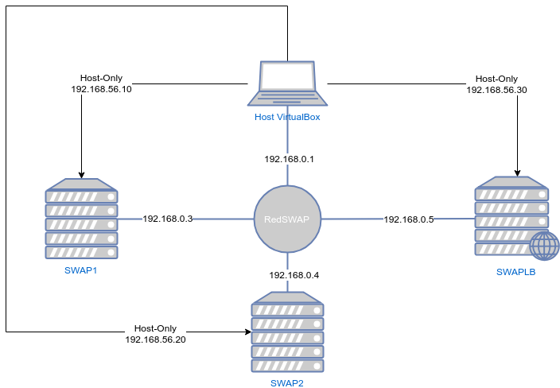
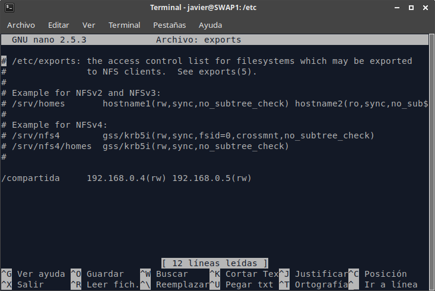
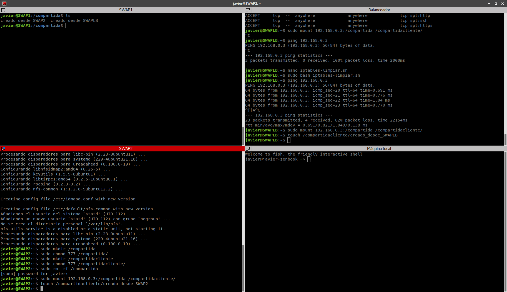

# Práctica 6 - SWAP

## Servidor de disco NFS

## Autor: Javier Sáez de la Coba

## Objetivos

En esta práctica vamos a compartir archivos entre servidores por medio de la red. Para ello vamos a usar el servicio NFS, que está integrado en el propio kernel de linux. Este servicio permite compartir discos y carpetas entre red de forma que haya varios clientes conectados de forma simultánea.

El esquema de nuestra red es el siguiente:



## 1.- Configuración del servidor.

Vamos a usar el servidor SWAP1 como servidor para compartir archivos. Para activar el servicio NFS primero tenemos que instalalarlo. Para ello usamos 

`sudo apt-get install nfs-kernel-server nfs-common rpcbind`

Una vez instalado tenemos que crear la carpeta (o el punto de montaje) que queremos compartir. Nosotros vamos a compartir la carpeta `/compartida`. Para crearla tenemos que tener especial cuidado de que todos los usuarios puedan escribir en dicha carpeta. Para ello empezamos haciendo que esta carpeta no ea propiedad de ningún usuario y luego damos permisos para que todos los usuarios puedan escribir.

```bash
javier@SWAP1:~$ sudo mkdir /compartida
javier@SWAP1:~$ sudo chown nobody:nogroup /compartida/
javier@SWAP1:~$ sudo chmod 777 /compartida/
```

Ahora tenemos que decirle al servicio NFS que queremos compartir esta carpeta. Además vamos a aplicar una regla de control de acceso para que solo las máquinas con las IPs que nosotros queramos puedan entrar a los datos. NFS es un sistema sin ningún tipo de autenticación por defecto, ni sistema de encriptación, por lo que deberíamos ejecutar este servicio solo en redes que nosostros controlemos totalmente (DMZ). 

Para activar la compartición modificamos el archivo `/etc/exports`



Con esto una vez que reiniciemos el servicio ya podrían empezar a conectarse nuestros clientes

## 2.- Configuración de clientes

Para configurar los clientes primero tenemos que instalar (si no lo está ya) el cliente de NFS. En sistemas basados en debian podemos hacerlo así:

`sudo apt-get install nfs-common rpcbind`

Creamos una carpeta donde queremos montar la carpeta remota (no tienen por qué llamarse igual).

```bash
javier@SWAP2:~$ sudo mkdir /compartidacliente
javier@SWAP2:~$ sudo chmod 777 /compartidacliente/
```

Ahora ya podemos montar la carpeta compartida en los clientes. Vamos a montarlo primero de forma manual y luego lo metemos en el `/etc/fstab` para que la carpeta se monte de forma automática.



La línea que tenemos que añadir a los `/etc/fstab` de los clientes es la siguiente:

`192.168.0.3:/compartida	/compartidacliente	nfs	auto,noatime,nolock,bg,nfsvers=3,intr,tcp,actimeo=1800	0	0`

Una vez añadida la línea, al reiniciar las máquinas (si el servidor está disponible) se montará la carpeta de red de forma automática.