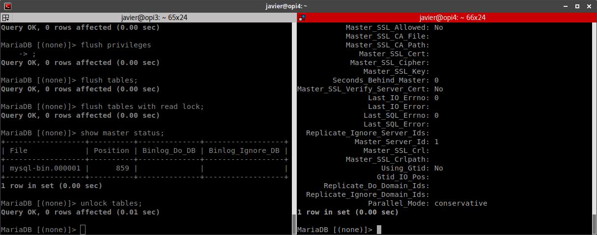

# Trabajo SWAP

## Despliegue de una granja web sobre hardware real

En este trabajo vamos a construir una granja web (Balanceador de carga, servidor web, servidor de base de datos y servidor de archivos) sobre hardware real. Los equipos a usar van a ser 4 Orange Pi Zero y 2 Raspberry Pi. Este hardware destaca por su bajo coste y bajo consumo energético, por lo que vamos a demostrar además sus capacidades como hardware de servidor y su posible utilidad como hardware de granjas web de bajo coste.


### Preparación del entorno

El entorno que queremos conseguir es el siguiente:


Para ello primero tenemos que preparar los equipos, asignándoles direcciones IP y nombres de host.

Para ello modificamos los archivos `/etc/hostname` y `/etc/hosts` para cambiar el nombre del host. Además ponemos el siguiente contenido en `/etc/network/interfaces`. Lo ideal sería que los equipos tuvieran, al menos dos NIC, una para la red de datos y otra para la red de gestión. Como con estos equipos eso no es posible vamos a darles dos direcciones IP a la misma tarjeta de red. Para ello configuramos de la siguiente forma:

```
auto lo
iface lo inet loopback

auto eth0
allow-hotplug eth0
iface eth0 inet static
    address 192.168.1.41/24

auto eth0:0
allow-hotplug eth0:0
iface eth0:0 inet static
    address 192.168.2.41/24
    gateway 192.168.2.1

```

La asignación de IP's que hacemos es la siguiente:

| Equipo | IP1          | IP2          |
| ------ | ------------ | ------------ |
| opi1   | 192.168.1.40 | 192.168.2.40 |
| opi2   | 192.168.1.41 | 192.168.2.41 |
| opi3   | 192.168.1.42 | 192.168.2.42 |
| opi4   | 192.168.1.43 | 192.168.2.43 |
| rpi1   | 192.168.1.44 | 192.168.2.44 |
| rpi2   | 192.168.1.45 | 192.168.2.45 |

Una vez tenemos todo el entorno configurado vamos a montar nuestra granja web. 

### Planteamiento de la granja web

Vamos a montar una granja web que ejemplifique el uso de una aplicación web real. Para ello vamos a necesitar 2 servidores web con un balanceador delante de ellos. Estos servidores tendrán un sistema memcached distribuido para mantener la información de las sesiones de forma coherente entre ellos, ya que vamos a usar `nginx` como balanceador con política round-robin.

Como base de datos vamos a usar MySQL en configuración maestro-esclavo. En el caso de que el servidor principal cayera sería tan sencillo como ejecutar un cambio de dirección IP en el esclavo para que los clientes crean que es el maestro. Luego tan solo tendríamos que volver a sincronizar la base de datos entre ambos servidores y volver a la situación inicial cuando el servidor caído se recupere.

Todo el sistema va a estar monitorizado por una instalación de Zabbix que va a monitorizar tanto equipos como servicios. Gracias a esta monitorización podremos saber si hay fallos de cualquier tipo, si algún servidor cae o si estamos experimentando problemas de sobrecarga del sistema.

### Instalación de MySQL

Vamos a empezar instalando el servidor de mysql en las opi3 y opi4. Para la compartición de archivos vamos a configurar los servidores web para que monten una carpeta de opi3 por sshfs. Además vamos a configurar `rsync` entre opi3 y opi4 para que los archivos del servidor web estén replicados en todo momento. Al hacer que los servidores web tengan los archivos a servir en un servidor externo hacemos que se puedan sustituir lo más rápido posible.

Para empezar hacemos simplemente `sudo apt install mysql-server` en ambos servidores


Una vez que tenemos el servidor seguimos los pasos de la Práctica 4 de la asignatura para configurar la base de datos `wordpress` en modo maestro-esclavo.




Con esto ya tenemos configurado el servicio de MySQL.

Además vamos a instalar el zabbix-agent en ambas máquinas con `sudo apt install zabbix-agent`

### Instalación del balanceador de carga

Como balanceador de carga vamos a usar `nginx`. Para su instalación hacemos simplemente `sudo apt install nginx`

Para configurar `nginx` vamos a usar una configuración muy similar a la de la práctica 2 de la asignatura. Para ello modificamos el archivo `/etc/nginx/sites-available/balanceo`

```
upstream apaches {
   server 192.168.1.40;
   server 192.168.1.41;
}
   server{
   listen 80;
   server_name balanceador;
   access_log /var/log/nginx/balanceador.access.log;
   error_log /var/log/nginx/balanceador.error.log;
   root /var/www/;
   location /
   {
      proxy_pass http://apaches;
      proxy_set_header Host $host;
      proxy_set_header X-Real-IP $remote_addr;
      proxy_set_header X-Forwarded-For $proxy_add_x_forwarded_for;
      proxy_http_version 1.1;
      proxy_set_header Connection "";
   }
}
```

Con esto ya tenemos el balanceador configurado.


### Instalación de los servidores web

Vamos a crear primero un directorio en la máquina servidora de contenido y un usuario con permisos de acceso a dicho directorio.

La máquina elegida como master de archivos va a ser el esclavo de mysql.

Creamos un usuario `datos` en dicha máquina y le asignamos la propiedad del directorio con `chown`. Luego montamos mediante `sshfs` de forma automática (haciendo previamente un intercambio de claves de ssh entre las máquinas) añadiendo a `/etc/fstab` la siguiente línea.

```
datos@192.168.1.43:/datosweb /datosweb fuse.sshfs delay_connect,_netdev,user,transform_symlinks,identityfile=/root/.ssh/id_rsa,allow_other,default_permissions 0 0
```

Cabe notar que todas las conexiones de datos se están haciendo mediante la subred `192.168.1.0/24`, reservando la subred `192.168.2.0/24` para la gestión de las máquinas.

Una vez montado el directorio remoto para el servidor web cambiamos el archivo de configuración de apache2 en los servidores `opi1` y `opi2` para que utilicen como `DocumentRoot` dicho directorio. Para ello, modificamos el archivo `/etc/apache2/sites-enabled/default` de la siguiente manera:

```
<VirtualHost *:80>
	ServerAdmin webmaster@localhost
	DocumentRoot /datosweb/html/

	<Directory /datosweb/html/>
    Options Indexes FollowSymLinks MultiViews
    AllowOverride None
    Require all granted
    Order allow,deny
    allow from all
  </Directory>

	ErrorLog ${APACHE_LOG_DIR}/error.log
	CustomLog ${APACHE_LOG_DIR}/access.log combined

</VirtualHost>
```

Ahora solo nos falta configurar `memcached` para mantener las sesiones entre los dos servidores. Seguimos el tutorial encontrado [aquí](https://www.digitalocean.com/community/tutorials/how-to-share-php-sessions-on-multiple-memcached-servers-on-ubuntu-14-04) modificando primero `/etc/memcached.conf` y luego los archivos de configuración de php. Con esto y un sencillo script de php podemos ver como la información de sesiones se mantiene entre los servidores:


### Repaso hasta ahora

Llegados a este punto tenemos dos servidores de bases de datos redundantes, dos servidores web con un almacén de datos común y compartición de sesiones con `memcached` y un balanceador de carga http. Antes de seguir con el despliegue de algún servicio vamos a configurar Zabbix como herramienta de monitorización de toda nuestra granja web.

La conexión de Zabbix con las máquinas se va a realizar a través de la interfaz de "gestión", ya que en caso de que la red de datos se sobrecargara por exceso de tráfico tendríamos que seguir monitorizando los servidores. En caso de que implementáramos heartbeat también lo haríamos a través de esta interfaz. Aunque en nuestro caso las interfaces de datos y gestión son la misma, en una granja web profesional tendríamos dos NIC's separadas, por lo que se ha optado por este esquema de emular multi-NIC's para que el ejemplo sea lo más fiel posible al entorno profesional.

Siguiendo el [este](https://linuxhint.com/install_zabbix_raspberry_pi/) manual instalamos Zabbix


Ahora vamos a desplegar una aplicación web en nuestra recién montada granja web, por ejemplo, vamos a hacer una instalación básica de wordpress.

### Instalación de wordpress

No es el objetivo de este trabajo explicar cómo se hace una instalación de wordpress, para ello está la información de la página oficial. Básicamente hemos copiado el .zip de la instalación en la carpeta compartida entre los servidores y hemos hecho la instalación web sin preocuparnos en ningún momento de sobre que servidor nos estábamos ejecutando. Por último hemos entrado a la administración del blog y hemos creado una entrada. Este es el resultado:


En resumen lo que hemos montado ha sido un conjunto de 6 servidores que funcionan todos en conjunto para servir una aplicación web. El sistema está diseñado para alta disponibilidad y redundancia de datos, por lo que si algún servidor cae no se pierde casi la funcionalidad del sitio y no se pierde ningún dato.

Además en este sistema todo está montado con hardware barato e incluso reciclado, alcanzando un valor total de menos de 200€.


Por último me gustaría adjuntar una foto de todo el sistema hardware:

